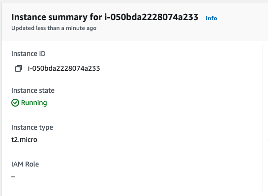
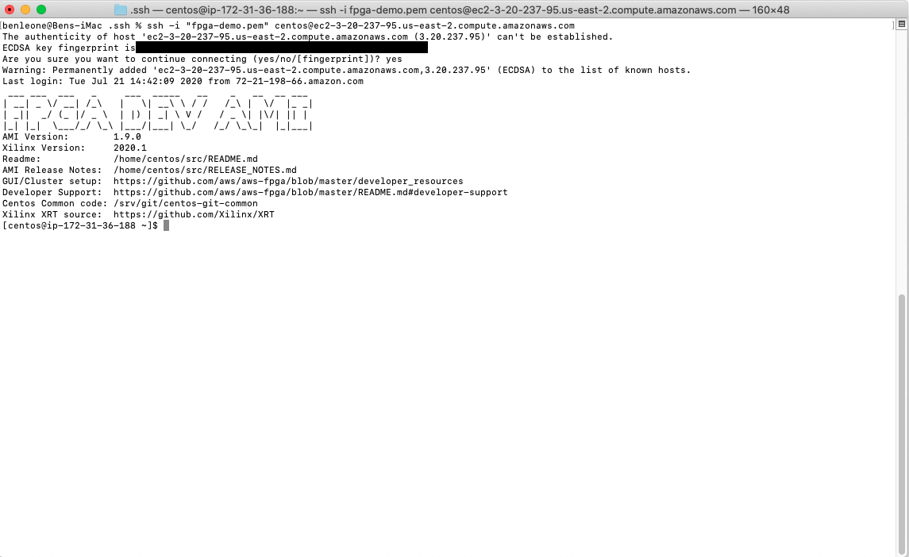
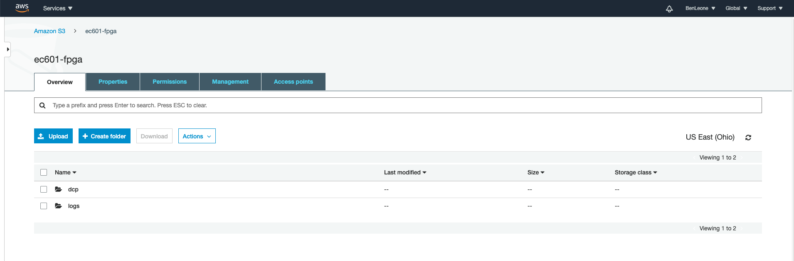
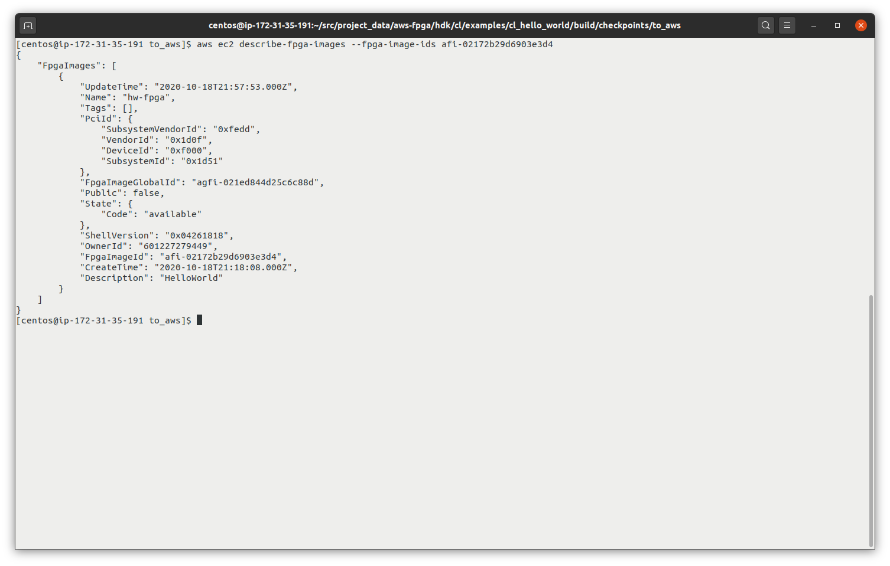
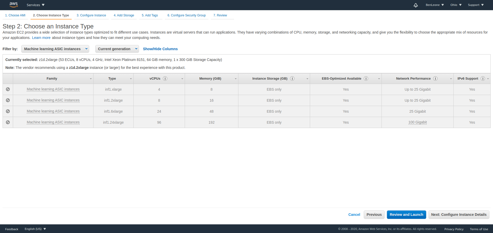

# EC601 Project 3

## Phase 1: AWS FPGA Getting Started

For the first phase of Project 3, the [AWS FPGA Quick Starts](https://github.com/aws/aws-fpga#quickstarts) were used as an example of how to work with the AWS instances, the command-line tools, S3 buckets, and other items as needed. Because the majority of this phase takes place in the EC2 F1 instance within the cloud, screenshots with descriptions are included below to show what steps were taken to get this phase working. Further, this [guide](https://caslab.csl.yale.edu/courses/EENG428/19-20a/tutorials/getting_started_hello_world.pdf) from Yale University's EENG 428 Cloud FPGA course provides a step-by-step process to implement the "Hello World!" example from AWS.



**Figure 1: AWS Console showing EC2 F1 instance of the t2.micro is running**



**Figure 2: AWS CLI once SSH into the F1 instance**



**Figure 3: AWS S3 buckets that will hold the digial checkpoints (DCP) and any error logs**



**Figure 4: After switch to a new EC2 instance, synthesis was successful and AFI creation was successful**

### Issues

Working to ensure that not a large cost is incurred is difficult due to the slow times of free instances in F1. This "Hello World!" example was run multiple times to verify the results that approached the limits of the free AWS tier.

**Update (10/13/2020)**
Synthesis did not complete fully and was forced to pause the F1 instance due to costs accumilating from the continual running of the instance.

**Update (10/18/2020)**
Synthesis was successful with a larger instance with more CPU bandwith and memory to complete in time. AFI creation was successful. However, when attempting to switch the instance to the f1.2xlarge as recommended, FPGAs were no longer available to users and have seemingly been replace by ASIC processors instead



## Phase 2: Building a Machine Learning Neuron
The machine learning neuron build was based on the code from the article [Machine Learning for Beginners: An Introduction to Neural Networks](https://towardsdatascience.com/machine-learning-for-beginners-an-introduction-to-neural-networks-d49f22d238f9).

From this helpful article, we were not only able to build a neuron - which takes inputs, applies a weight and a bias to them, and returns an output - we also build a simple machine learning algorithm that, after training, takes in an array of a weight and height of a person and suggests whether the person is male or female.

**Example:**
```
# Define dataset
data = np.array([
    [-2, -1],  # Alice
    [25, 6],   # Bob
    [17, 4],   # Charlie
    [-15, -6],  # Diana
])
all_y_trues = np.array([
    1,  # Alice
    0,  # Bob
    0,  # Charlie
    1,  # Diana
])

# Train our neural network!
network = OurNeuralNetwork()
network.train(data, all_y_trues)

# Make some predictions
emily = np.array([-7, -3])  # 128 pounds, 63 inches
frank = np.array([20, 2])  # 155 pounds, 68 inches
print("Emily: %.3f" % network.feedforward(emily))  # 0.951 - F
print("Frank: %.3f" % network.feedforward(frank))  # 0.039 - M
```
