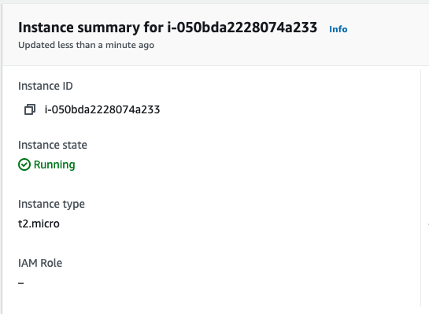

# EC601 Project 3

### Phase 1: AWS FPGA Getting Started

For the first phase of Project 3, the [AWS FPGA Quick Starts](https://github.com/aws/aws-fpga#quickstarts) were used as an example of how to work with the AWS instances, the command-line tools, S3 buckets, and other items as needed. Because the majority of this phase takes place in the EC2 F1 instance within the cloud, screenshots with descriptions are included below to show what steps were taken to get this phase working. Further, this [guide](https://caslab.csl.yale.edu/courses/EENG428/19-20a/tutorials/getting_started_hello_world.pdf) from Yale University's EENG 428 Cloud FPGA course provides a step-by-step process to implement the "Hello World!" example from AWS.

#### **Issues**

Working to ensure that not a large cost is incurred is difficult due to the slow times of free instances in F1. This "Hello World!" example was run multiple times to verify the results that approached the limits of the free AWS tier.

### Phase 2: Building a Machine Learning Neuron
